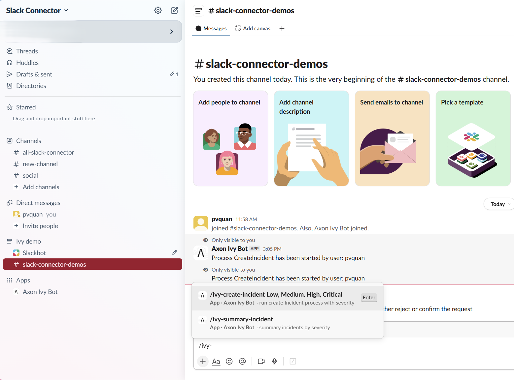
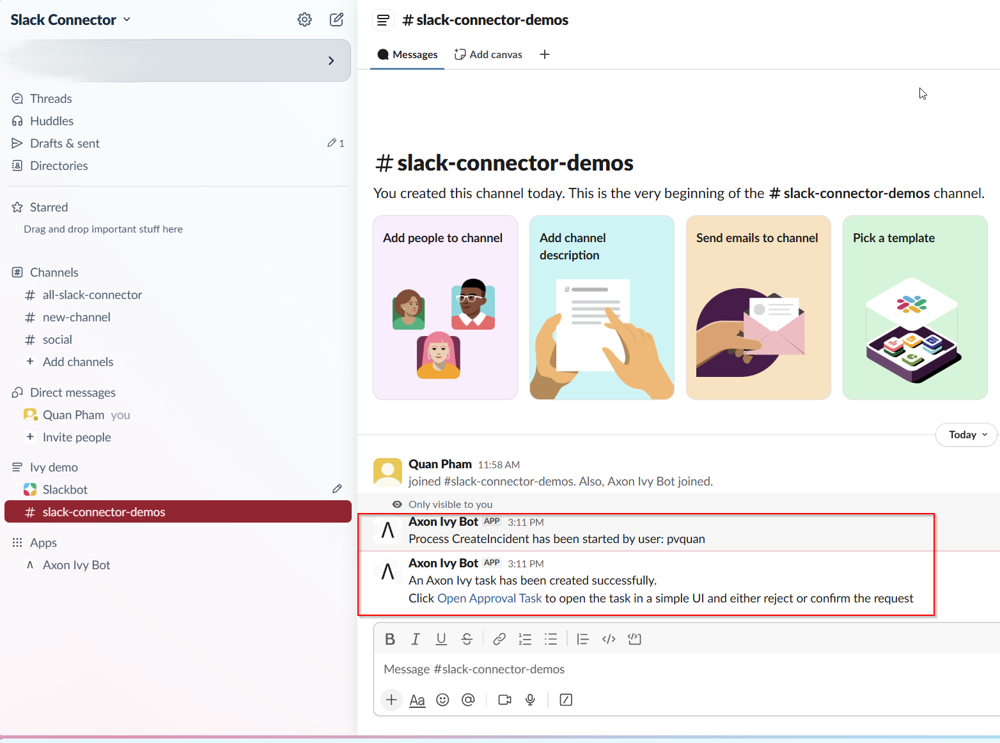
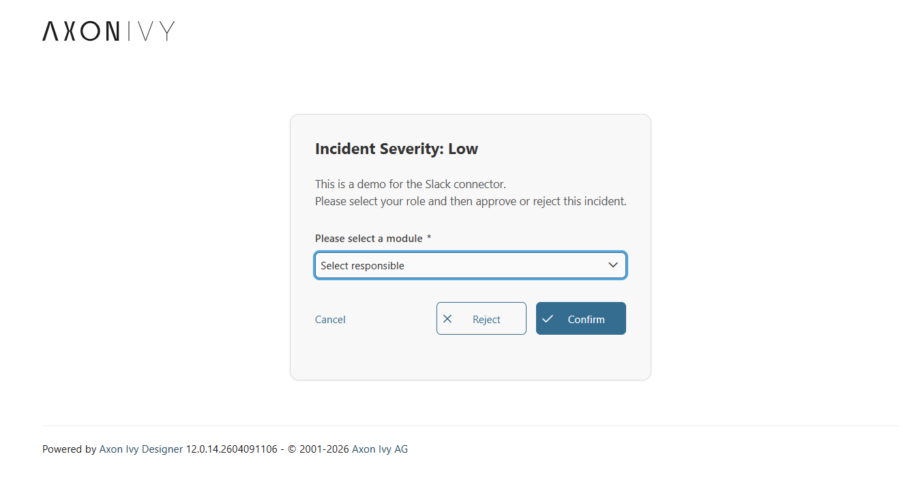
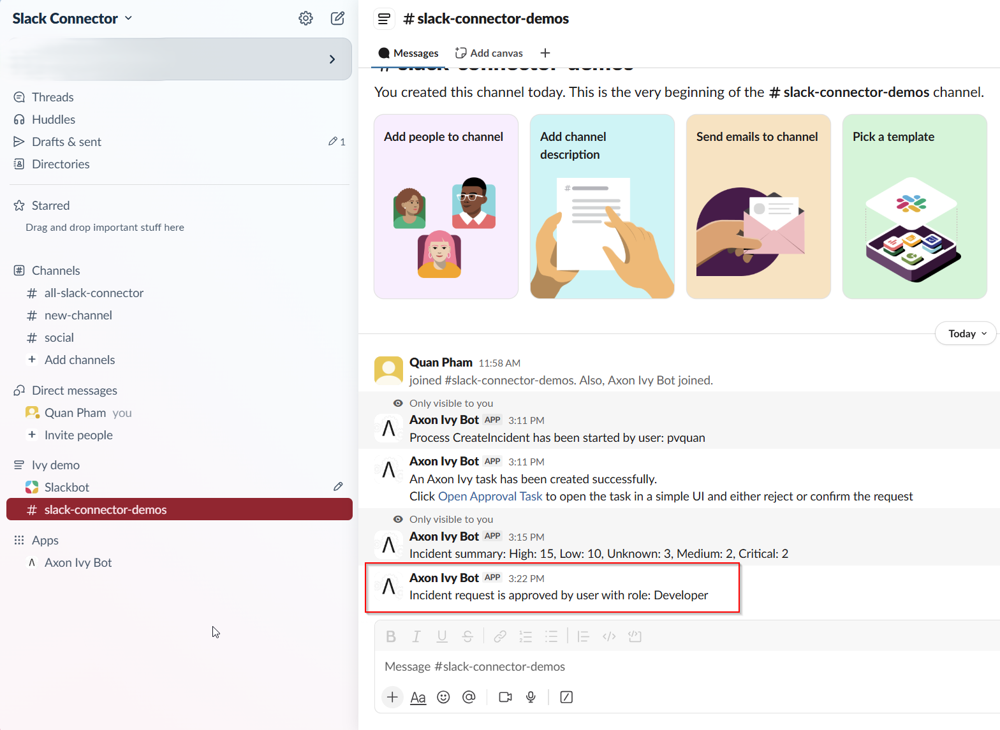
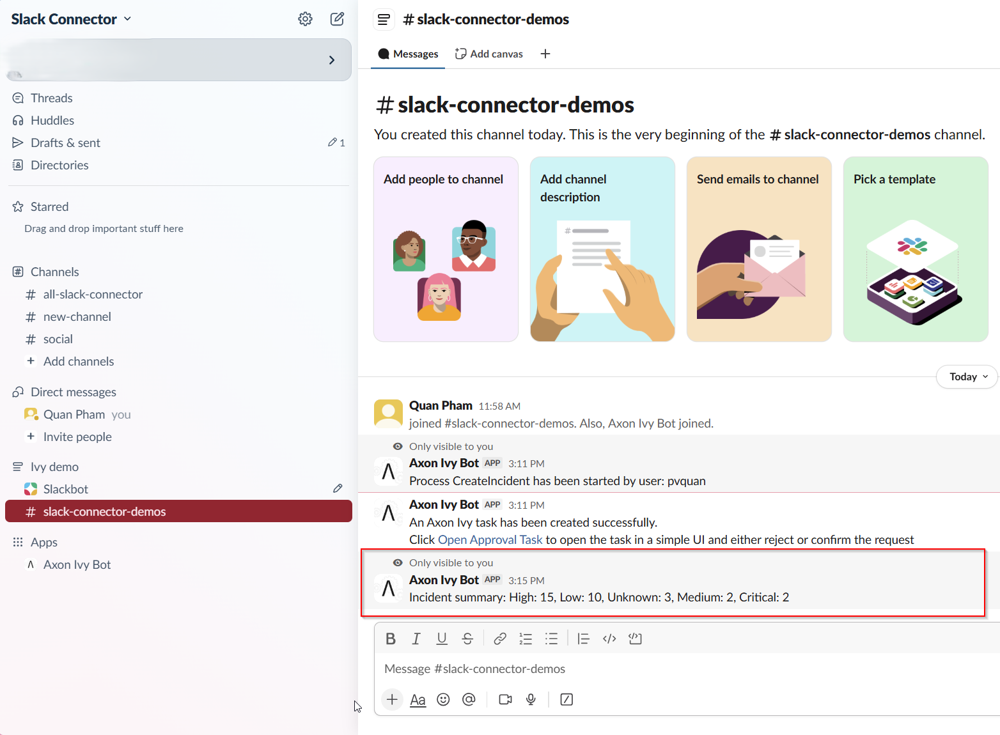
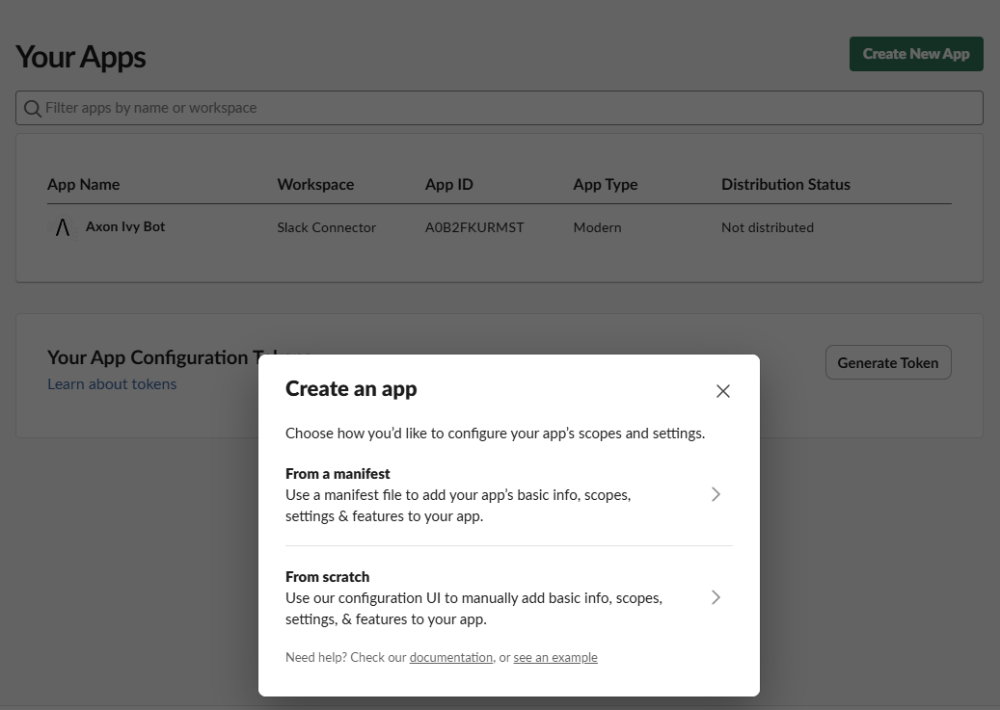
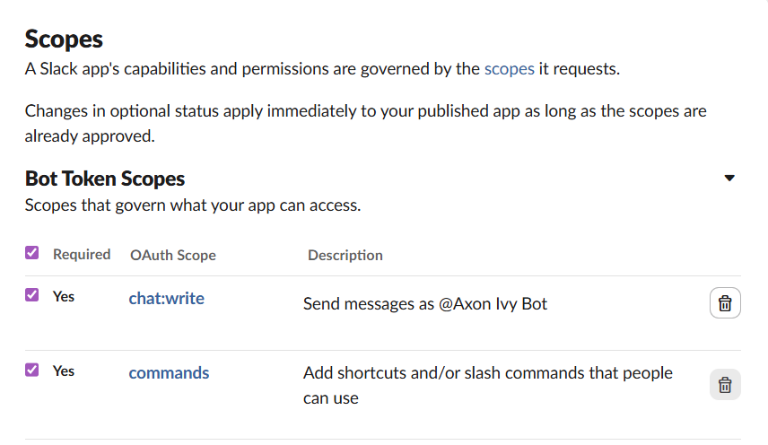
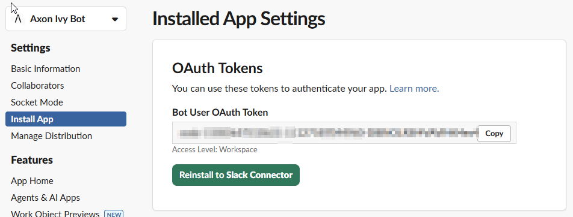
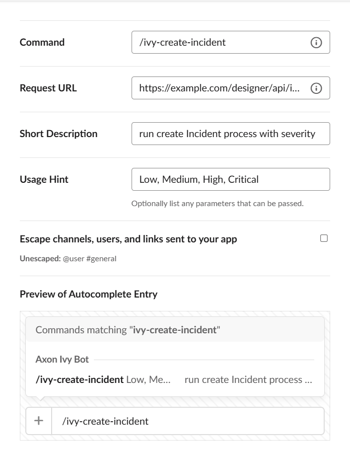

# Slack Connector

The Slack Connector integrates Axon Ivy with Slack, enabling processes to post messages, handle slash-commands, and trigger workflows directly from Slack channels and users. It provides a callable subprocess for sending messages, a small Java helper API, and demo workflows to help you evaluate and extend the integration.

### Key features

- Send messages to Slack channels and threads directly from Axon Ivy processes, enabling automated notifications and alerts.
- Simple Java helper API (`MessageService`) to send messages programmatically from Java code and process scripts.
- Handle Slack Slash Commands to start interactive workflows (e.g., create incidents) from Slack.
- Demo implementations for creating incidents and opening approval tasks to help you evaluate quickly.
- Easy configuration via product variables and ready-to-use demo installers for quick setup.

## Demo

The demo module shows how Slack commands, Axon Ivy cases, and Slack bot responses work together in one incident workflow. Use it to validate the end-to-end experience before integrating the connector into your own processes.

### Demo workflows

##### Create incident from Slack

1. Open a Slack channel where your app is installed and run `/ivy-create-incident` with a severity such as `Low`, `Medium`, `High`, or `Critical`.



2. Slack sends the form payload to the demo REST endpoint and Axon Ivy starts the `CreateIncident` case for the current user.



3. Open the approval task from the Slack message to review the incident details and choose the responsible role in the dialog.



4. Confirm or reject the request. The demo posts the decision back to the original Slack channel with the selected role.



5. Run `/ivy-summary-incident` to receive a quick severity summary of the currently running incidents in Slack.



##### Start task listener

1. Launch the `Task listener` installer entry from the demo module.
2. Keep the listener running while you create or assign tasks in Axon Ivy.
3. Review the Slack notifications that are sent when new approval work becomes available.

## Setup

### Variables

```
@variables.yaml@
```

1. Install the connector artifacts into your Axon Ivy environment.

- Import `slack-connector` for the core integration.
- Import `slack-connector-demo` as well if you want the sample slash commands, dialog, and task listener.

2. Create the Slack app that will represent the Axon Ivy bot.

- Open https://api.slack.com/apps and click **Create New App**.
- Choose **From scratch**, enter a name such as `Axon Ivy Bot`, and select the target Slack workspace.



3. Add the bot scopes required by the connector.

- Open **OAuth & Permissions** in your Slack app.
- Add `chat:write` so the bot can post incident updates.
- Add `commands` so Slack can execute the slash commands.
- Add `chat:write.public` as well if you want the bot to post to public channels before it is invited.



4. Install the app into your workspace and copy the bot token.

- Open **Install App** and authorize the app for your workspace.
- Copy the **Bot User OAuth Token** shown after installation.
- Store that token in the Axon Ivy variable `com.axonivy.connector.slack.botToken`.
- Keep the value outside source control and replace local test tokens before sharing the project.



5. Create the slash commands used by the demo.

- Open **Features** -> **Slash Commands** and click **Create New Command**.
- Create the slash command eg.. `/ivy-create-incident` and set the Request URL to your public Axon Ivy custom URL.
- A usage hint such as `Low, Medium, High, Critical` could be use to pass param from the Slack to Axon Ivy Application.
- Reinstall the app if Slack asks you to refresh permissions after saving the commands.



## Components

### Callable Subprocesses

#### SendBotMessage.p.json

- **sendBotMessage(String message, String channel, String botToken)**
  - Input:
    - `message` (String) — message text to post
    - `channel` (String) — channel ID or name
    - `botToken` (String) — optional Bot OAuth token to use for the call

### Dialog Components

There is no available Dialog component.

### Web Services

- **Slack API (Slack Web API)** — Spec URL: `https://github.com/slackapi/slack-api-specs/blob/master/web-api/slack_web_openapi_v2.json` (Namespace: `com.slack.api.client`)

### Maven Artifacts

1. com.axonivy.connector.slack:slack-connector

```xml
<dependency>
  <groupId>com.axonivy.connector.slack</groupId>
  <artifactId>slack-connector</artifactId>
  <type>iar</type>
</dependency>
```

2. com.axonivy.connector.slack:slack-connector-demo (optional)

```xml
<dependency>
  <groupId>com.axonivy.connector.slack</groupId>
  <artifactId>slack-connector-demo</artifactId>
  <type>iar</type>
</dependency>
```
